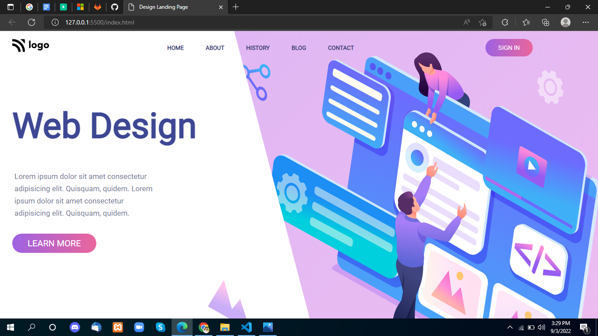

# Project-8

 

## Project live link
[https://my-project-08.netlify.app/](https://my-project-08.netlify.app/ "project08")

## Screenshot

 

## project Type
- UI Design
- One Page Website

## My learning from this Project
- How to design HTML Code
- linear-gradient Effect
- Grid

## Time to make this project
#### Approx 4 hour to make this project
